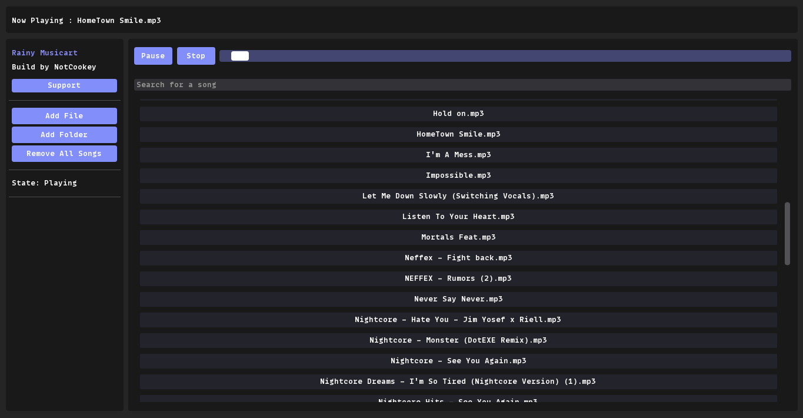

<h2 align="center">Rainy Musicart</h2>

<b>Rainy Musicart is a lightweight music player with an aesthetically pleasing design</b>

<kbd></kbd>

## About
- **Rainy Musicart is a lightweight music player built in Python that makes use of the lovely [DearPyGui](https://github.com/hoffstadt/DearPyGui/) for the aesthetically designed interface as well as a number of third-party libraries.**

## Install
- **Download the repository**
- **Install dependencies using pip `pip install -r requirements.txt`**
- **Run Rainy.py**

